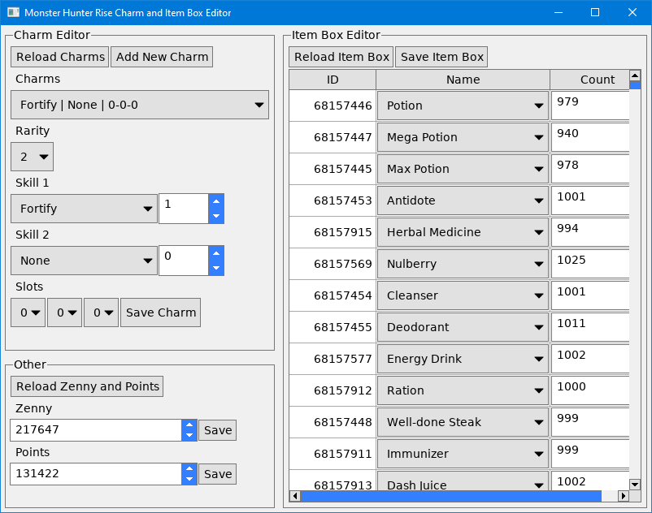

# Monster Hunter Rise Charm and Item Box Editor
This is a program for editing your in-game charms and item box contents, you can also set your points and money using it.
It is based on [mhr-charm-item-editor](https://github.com/Fexty12573/mhr-charm-item-editor) by Fexty12573.

The original UI was using Winforms which struggles on 4K displays so I thought it might be fun to port it to my own UI library.
This version works on both Linux and Windows.
The Linux version was tested on Linux Mint 20.3 with the game running through Proton Experimental.

The program works on game version 3.9.1.0 the last one before the Sunbreak expansion.
There is a high chance that Sunbreak will break the program since it relies on specific offsets into the game process memory.

I have been using it without issues but, never the less, backup your save just in case something gets messed up.

For creating legal charms consult this page: [Charm skills & slots googlesheet](https://docs.google.com/spreadsheets/d/1iBgTZttW-ECbRUy_9zm_FFuiQbi9LT93KuY-2iK5t_g/edit#gid=0)

The pre-built executable in the releases page should work on a fresh Windows 10 install provided you have installed your graphics drivers and your graphics card supports OpenGL Core 3.3, but if you can run the game then it should be fine.
On Linux you will need to build it yourself.

Make sure the game is running and you have loaded a save before starting the program!

## Build
### Windows
On Windows installing the `Desktop development with C++` workload through the Visual Studio installer and CMake should be enough to build the project.
Afterwards you can simply run the `build` batch file in the root directory of the project.
This will build the release version of the program and put it in the root directory of the project.

### Linux
On Ubuntu based systems you should be set by running the following command `sudo apt install g++ make cmake libsdl2-dev`.
On other Linux flavours you will have to figure out the equivalent.
Once you have all dependencies simply run `make` in the root directory of the project.
This will build the release version of the program and put it in the root directory of the project.
